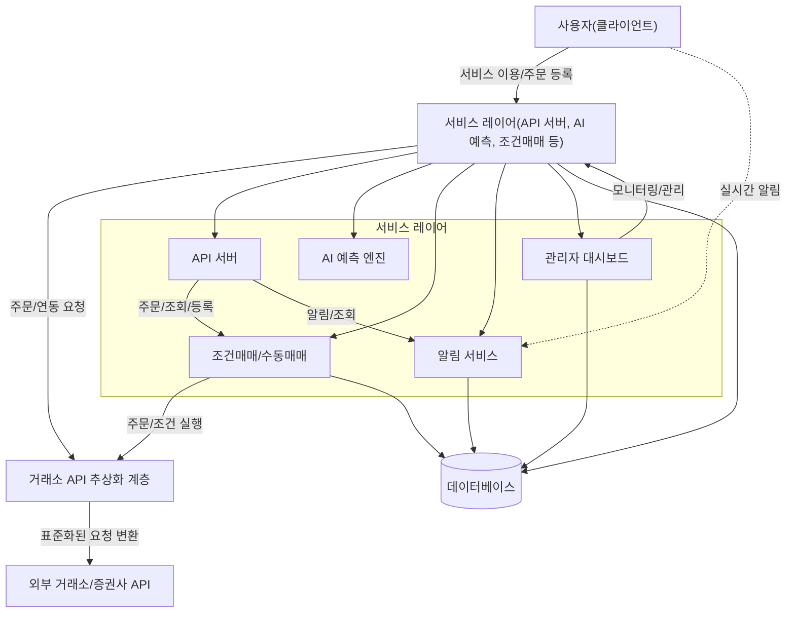
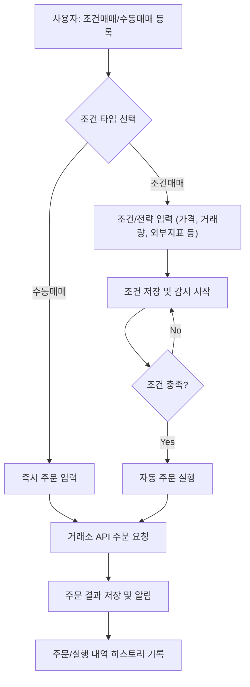
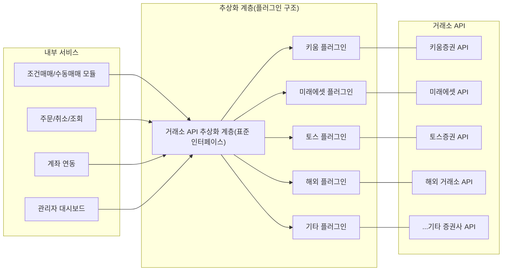
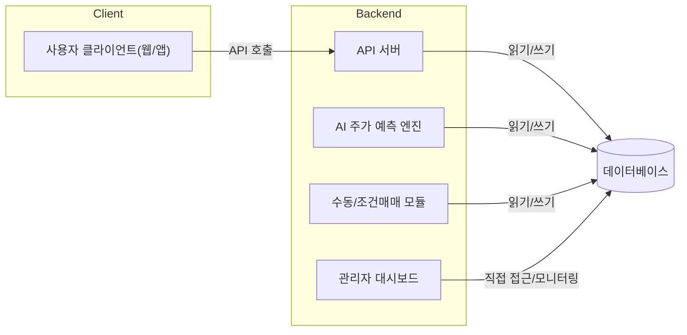
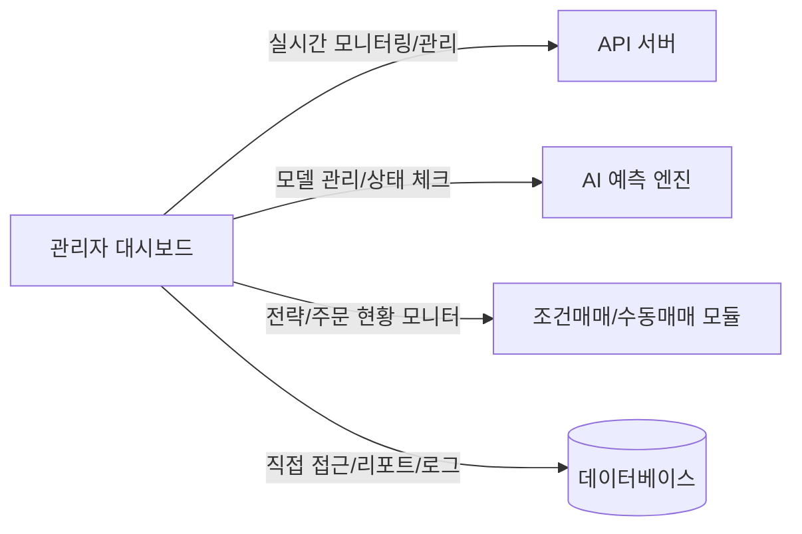
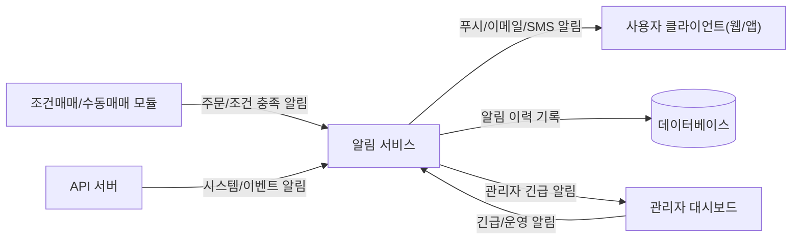
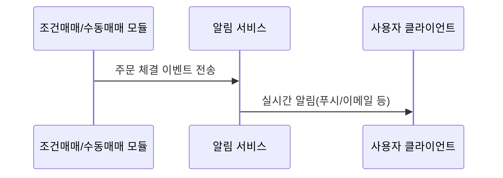
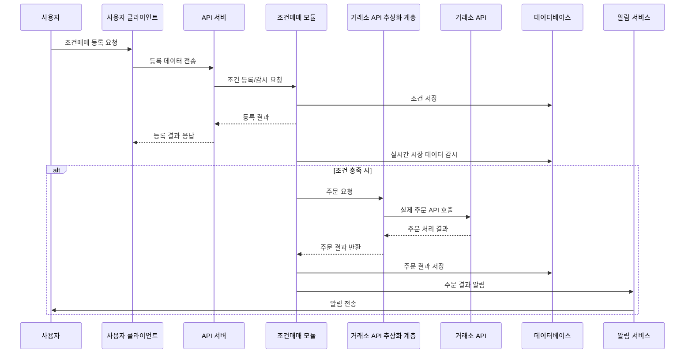

# 시스템 아키텍처 (System Architecture)

---

## 아키텍처 다이어그램



---

## 주요 컴포넌트

- [사용자 클라이언트(웹/앱)](#사용자-클라이언트웹앱)
- [API 서버](#api-서버)
- [AI 주가 예측 엔진](#ai-주가-예측-엔진)
- [수동 매매/조건 매매 모듈](#수동-매매조건-매매-모듈)
- [거래소 API 추상화 계층](#거래소-api-추상화-계층)
- [데이터베이스](#데이터베이스)
- [관리자 대시보드](#관리자-대시보드)
- [알림 서비스](#알림-서비스)

---

### 사용자 클라이언트(웹/앱)

사용자가 서비스에 접속해 기능을 이용하는 프론트엔드

- **주요 기능**
  - 회원가입/로그인(2FA)
  - 계좌 연동(증권사 API 인증)
  - 포트폴리오 및 종목 관리
  - AI 예측 결과 및 리포트 확인
  - 조건매매 등록/수정/삭제
  - 직접 매매(주문/취소)
  - 실시간 거래 내역 알림(푸시/이메일)
  - 거래내역, 알림, 예측 결과 히스토리 조회
- **연결**
  - API 서버와 통신 (REST API/WebSocket 등)
  - 알림 서비스 연동

---

### API 서버

모든 외부/내부 통신을 중재하는 백엔드 핵심 허브

- **주요 기능**
  - 인증/인가(토큰 관리, 2FA, 권한 분리)
  - 사용자 요청 처리 및 라우팅(포트폴리오, 주문 등)
  - AI 예측 엔진, 조건매매 모듈, DB, 알림 모듈 등과 연동
  - 데이터 검증 및 예외 처리, 트랜잭션 관리
- **연결**
  - 프론트엔드(클라이언트) ↔ API 서버 ↔ 내부 컴포넌트(엔진/DB 등)
  - 외부 증권사 API 연결 요청 중계

---

### AI 주가 예측 엔진

다양한 주가 예측 모델 제공 및 관리

- **주요 기능**
  - 여러 모델 운영:  
    - `SimpleLSTM`: 기본 시계열 예측  
    - `TransformerTrader`: 고급 딥러닝 기반 예측  
    - `SentimentMix`: 뉴스/이슈/감성 데이터 결합형
  - 예측 결과 저장/버전 관리
  - 사용자별 맞춤 예측(종목, 주기 등)
  - 예측 방법 안내 및 예측 결과 신뢰도 정보 제공
  - 과거 데이터 기반 백테스팅/성능 리포트
  - 관리자용 모델 추가/업데이트
- **연결**
  - API 서버를 통해 예측 요청/응답
  - DB에 결과 저장, 관리자 대시보드와 연동
- **예시 시나리오**
  1. 하나의 특정 종목에 대한 예측
     **사용자 A**가 "SimpleLSTM" 모델로 삼성전자 주가 7일 예측 요청
     → API 서버 → 예측 엔진 → LSTM모델 결과 → 예측치+신뢰도 제공
     → 결과는 DB 저장, 사용자 클라이언트에 전송
  2. 여러 종목에 대한 예측
     **사용자 B**가 "TransformerTrader"로 관심종목 전체 예측
     → 결과별 신뢰도/예측 방법 안내
     → 사용자별 예측 히스토리 제공
  3. 모델 업데이트
     **관리자**가 새 모델 "SentimentMix" 테스트/배포(버전 관리 기반)
     → 예측 성능 리포트 생성 → 성능 낮으면 자동 롤백

- **추가 설명**
  - 예측 요청/응답 시, 모델별 "설명(Explainability)" 및 "근거 데이터(주요 변수/이슈)"도 같이 반환
  - 모델 간 성능 비교 및 사용자 별 커스텀 추천 기능 지원 가능

---

### 수동 매매/조건 매매 모듈

주식 자동매매 서비스에서 **수동 매매/조건 매매 모듈**은  

1. 사용자가 직접 주문을 입력하거나,
2. 사용자가 설정한 '특정 가격·지표' 조건이 만족하거나,
3. AI에 의해 설정된 조건이 만족했을 때,

자동으로 주문이 실행되도록 감시·처리합니다.

예를 들어, “삼성전자 가격이 5만 원 이하가 되면 매수” 같은 조건을
미리 등록해두면, 시스템이 실시간으로 시장 데이터를 감시하다가
조건이 충족되는 즉시 주문을 넣습니다.

또한, 모든 주문과 실행 내역은 실시간 알림과 함께 히스토리로 관리되어
투명한 거래와 효과적인 투자 전략 관리를 돕습니다.



- **주요 기능**
  - 사용자 조건매매(가격, 기간, 트리거 등) 등록/감시/실행
  - AI 예측 신호 기반 자동매매
  - 수동 주문/취소 처리
  - 조건 충족/실행 시 거래소 API 호출
  - 주문 체결 결과 처리 및 알림 전송
  - 백테스팅(조건매매 전략 검증)
- **관찰/트리거 지표 예시**
  - **기본 가격/변동**
    - 지정가, 시장가, 전일 종가, 당일 고가/저가 돌파
    - 일정 가격 이상/이하 도달
    - 정해진 퍼센트 이상 변동 시
  - **거래량/유동성**
    - 일정 거래량 돌파(평균 대비 급증 등)
    - 거래량 급감/급증 시 트리거
  - **지표/시장 데이터**
    - VIX(변동성 지수)가 일정 수치 이상일 때
    - 채권 가격(미국 10년물 등) 변동 시
    - 원/달러 환율, 금값, 국제유가 등
    - 빅맥지수(국가별 물가/환율 지표)
    - PER, PBR 등 재무지표
  - **기타 특이 이벤트**
    - 뉴스 발생(특정 키워드 감지)
    - 배당락/분기 실적 발표 등
- **주요 매매 전략 예시**
  - **고점 돌파(돌파매매) 전략**
    - 최근 n일 최고가 갱신 시 매수
    - 일정 저항선 돌파 시 진입
  - **이동평균선(이평선) 교차 전략**
    - 단기 이평선이 장기 이평선 돌파 시 매수
  - **거래량 추종 전략**
    - 거래량 급증 종목 매수/매도
  - **변동성 돌파 전략**
    - 당일 변동폭이 일정 기준 돌파 시 진입
  - **AI 예측 신호 추종**
    - 예측 신뢰도 n% 이상일 때 자동 진입/청산
  - **분할 매수/매도, 트레일링 스탑, 시간 분할 주문 등**
    - 여러 번에 나눠 거래, 손실/이익 자동 보호 등

- **연결**
  - API 서버 ↔ 거래소 API 추상화 계층
  - DB에 주문/이력 기록, 알림 서비스와 연동
- **예시 시나리오**
  1. **수동 주문 예시:**
     → 사용자가 직접 주문 요청 → 즉시 거래소 API 호출 및 결과 반환
     → 성공/실패 여부와 주문 내역 알림
  2. **가격 조건 매매 예시:**
     **사용자 C**가 "삼성전자 5만 원 이하 시 매수" 조건 등록
     → 조건매매 모듈이 실시간 가격 감시 → 조건 충족 시 자동 주문
     → 거래소 API로 주문 실행 → 체결 결과 DB/사용자에 알림
  3. **거래량 기반 조건 매매 예시:**
     "평균 거래량 3배 이상 발생 시 진입"  
     → 거래량 감시 → 트리거 발생 시 자동 주문
  4. **VIX/환율 등 외부 지표 연동 매매 예시:**
     "VIX 30 이상, 원달러 1,400원 돌파 시 매도"
     → 외부지표 API 연동, 실시간 감시 및 주문
  5. **AI 신호 연동 자동매매:**  
     "AI 신뢰도 85% 이상 상승 예측 시 매수"  
     → 예측 결과 자동 반영하여 주문
  6. AI 모델 기반 조건 매매
     **사용자 D**가 "AI 신뢰도 85% 이상 상승 예측 시 매수" 설정
     → AI 예측 엔진 신호 감지 → 조건매매 모듈이 자동 주문 생성  
     → 주문 결과 알림 및 히스토리 기록

- **추가 설명**
  - UI 기반 다양한 조건(가격, 시간, 거래량 등) 조합 지원  
  - 각 전략은 시뮬레이션/백테스팅으로 성능 검증 가능
  - 옵션 확장 가능(알림만 받기, 조건 중복 조합, 사용자 전략 저장 등)
  - 향후 "트레일링 스탑", "분할 매수/매도" 등 전략 확장

---

### 거래소 API 추상화 계층

> *(이 모듈에 대한 내용은 주로 개발자(L3)·설계자(L4)를 위한 내용입니다.
> 일반 사용자(L1·L2)는 직접적으로 만날 일이 없고,
> 서비스 확장/유지보수에 중요한 역할을 합니다.)*

여러 증권사/거래소의 서로 다른 API를 하나로 통합해  
서비스 내부에서는 하나의 "표준 인터페이스"로만 연동하도록 한 계층입니다.

- 다양한 증권사/거래소 API 표준 인터페이스 제공
  - 서비스 기능(조건매매, 주문 등)을 변경 없이 다양한 거래소와 연결 가능
  - 계좌 연동(토큰, 인증서 등) 표준화
  - 주문/취소/조회/체결 기능 통합
  - 거래소별 오류/장애·지연 처리 통합
  - 거래 내역 일관성 유지 및 감사 로그 기록
- 신규 거래소/API 확장 지원(Plug-in 구조)
- 각 거래소별 장애, 인증, 속도제한, 고유 규칙 등도 이 계층에서 통합 관리



#### **확장/연동 시나리오 예시**

1. **신규 거래소(예: 토스증권) 추가**  
   → 플러그인 형식으로 ‘TossTradeProvider’ 구현  
   → 표준 인터페이스만 지키면 기존 서비스와 즉시 연동

2. **기존 API 변경/장애 발생**  
   → 추상화 계층에서만 수정/대응,  
      상위 서비스(조건매매 등)는 수정 필요 없음

    ```mermaid
    flowchart TD
        A[API 호출] --> B[Provider에서 응답 대기]
        B --정상응답--> C[응답 파싱 및 데이터 반환]
        B --오류/지연/비정상 응답--> D[에러 처리 로직 수행]
        D --> E{재시도 가능?}
        E --예--> F[일정 횟수 내 재시도]
        F --> B
        E --아니오/지속 오류--> G[장애 로깅 및 관리자 알림]
        G --> H[서비스는 타 거래소 주문/조회 등 정상 진행]
        H --> I[문제 해결 후 Provider Hot Swap/수정 배포]
    ```

3. **국내/해외 여러 거래소 다중 연동**  
   → 여러 거래소에 주문을 분산, 또는 복수 계좌 자동 매매 지원  
   → 모든 거래 내역을 일관된 포맷으로 DB에 기록

- **추가 설명**
  - 각 거래소 고유 기능(특수 주문, 이벤트 등)은 확장 메서드 또는 옵션으로 분리  
  - 공통 API(주문/조회 등)와 거래소별 특화 API 구분 설계  
  - 모든 거래 요청/응답은 보안(암호화/서명), 감사(로그), 장애 자동 복구 정책 포함

#### 개발자 관점 상세 설계

- **주요 구조**
  - Adapter, Factory, Strategy 패턴 결합  
    → `ITradeProvider` (표준 인터페이스: 주문, 체결, 잔고, 계좌 연동 등)
    → 각 거래소별 플러그인은 `ITradeProvider`를 구현
    → 신규 거래소 플러그인은 Factory에서 런타임 동적 생성/연결

    ```mermaid
    classDiagram
        class ITradeProvider {
          +place_order()
          +cancel_order()
          +get_balance()
        }
        class KiwoomProvider
        class MiraeProvider
        ITradeProvider <|-- KiwoomProvider
        ITradeProvider <|-- MiraeProvider
    ```

- **비동기/에러/속도제한**
  - 각 Provider별로 네트워크 오류/응답 지연/인증 만료 처리 내장
  - 주문/조회 API는 내부 큐+비동기 처리를 기본으로 설계
  - 요청 속도 제한(예: 키움 1초 5회)은 공통 쓰로틀러 모듈에서 처리

    ```mermaid
    flowchart TD
        A[내부 서비스에서 주문 요청] --> B[Provider 큐에 주문 등록]
        B --> C[비동기 스레드/이벤트 루프에서 API 호출]
        C --성공--> D[주문 응답 파싱]
        D --> E[DB에 결과 기록]
        E --> F[성공/실패 알림 전송]
        D --> G[감사 로그 저장]
        C --오류/Timeout--> H[에러 처리 및 재시도]
        H --재시도 후 실패--> I[에러 로그 저장, 관리자 알림]
        I --> J[문제 내역 감사 DB 저장]
    ```

- **확장/핫스왑**
  - 플러그인 구조로 Hot Reload/동적 교체 지원 (예: 신규 거래소 즉시 추가/테스트)
- **로깅/감사**
  - 모든 요청/응답/에러는 공통 로깅, 감사용으로 저장

---

### 데이터베이스

서비스의 모든 핵심 데이터(사용자, 계좌, 주문, 예측 결과, 알림, 감사로그 등)를
안전하게 저장/관리하는 **중심 저장소**입니다.
API 서버, 조건매매/수동매매 모듈, AI 예측 엔진, 관리자 대시보드 등
모든 주요 컴포넌트가 데이터베이스와 직접 또는 간접적으로 연결되어

- 사용자/주문 처리의 실시간 트랜잭션
- 투자 전략/예측 결과 관리
- 거래 이력/실행 내역 및 각종 통계/리포트
- 보안·운영상의 감사/로그 데이터

등을 일원화하여 관리합니다.



> **Note:**  
> 테이블 설계, 스키마, 인덱스 등 상세 데이터 구조는  
> [Database.md](./Database.md) 파일에 별도 분리되어 있습니다.

---

### 관리자 대시보드

**관리자 대시보드**는 서비스 전체의 운영 현황을 실시간으로 모니터링·관리하는  
중앙 관제 센터 역할을 합니다.

- **위치/연결**
  - API 서버, AI 예측 엔진, 조건매매/수동매매 모듈 등 모든 주요 백엔드 컴포넌트와 연동
  - 데이터베이스와 직접 연결해 실시간 통계, 리포트, 로그, 이상 거래 등 관리



---

### 알림 서비스

**알림 서비스**는  
주문 체결, 조건매매 실행, 시스템 이벤트(장애/이상) 등 서비스의 모든 주요 이벤트를  
**실시간으로 사용자(앱/웹) 또는 관리자에게 전달**하는  
핵심 정보 허브 역할을 담당합니다.



주문 체결 알림 플로우



- **위치/연결 구조**
  - 조건매매/수동매매 모듈, API 서버, 관리자 대시보드 등  
    모든 주요 컴포넌트와 직접 연동
  - 사용자 클라이언트(앱/웹) 및 관리자 대시보드에  
    푸시/이메일/SMS 등 다양한 채널로 알림 전송

- **주요 기능**
  - 주문 체결, 조건 충족, 시스템 이벤트 실시간 알림 전송
  - 사용자별 알림 구독/해제 및 채널 선택 지원
  - 관리자 대상 긴급/이상 알림
  - 모든 알림 이력 저장 및 조회
  - 이벤트별 우선순위/분류(일반, 경고, 긴급 등)

- **운영/확장성**
  - 멀티채널(푸시, 이메일, SMS 등) 및 신규 채널 손쉬운 확장
  - 모든 발송/수신 내역 DB 및 감사로그 관리
  - 장애·지연 시 자동 재시도, 운영자 즉시 알림

> **Note:**  
> 알림 메시지 구조, 상세 이벤트 분류, 수신 동의/설정 등은  
> [FeatureDesign.md](./FeatureDesign.md)에 별도 정리되어 있습니다.

---

## 데이터 흐름/상호작용

> *(이 섹션은 주로 개발자(L3), 설계자(L4),
> 그리고 서비스 운영·테스터(L2)를 위한 내용입니다.)*

이 섹션에서는 BotFolio 서비스의  
**주요 컴포넌트 간 데이터 흐름과 상호작용**을  
실제 사용 시나리오(예: 조건매매 등록~실행~알림)에 따라  
**시퀀스 다이어그램**으로 시각화합니다.

각 단계별로

- 사용자/클라이언트,
- API 서버,
- 조건매매 모듈,
- 거래소 API 추상화 계층,
- 데이터베이스,
- 알림 서비스

등이 어떤 식으로 데이터와 요청을 주고받는지
실제 흐름을 시각적으로 이해할 수 있도록 구성했습니다.



---

## 확장성/보안/운영 포인트

- 거래소/API/알림 등 모듈별 독립 설계로 신규 기능 추가·확장 쉬움
- 플러그인 구조로 신규 거래소 연동/교체가 간편함
- 2FA·토큰·암호화 등 다계층 보안 적용, 권한 분리 지원
- 실시간 장애 감지/모니터링 및 자동 복구(핫스왑, Failover)
- 모든 트랜잭션·알림·에러 일원화 로깅 및 감사 내장
