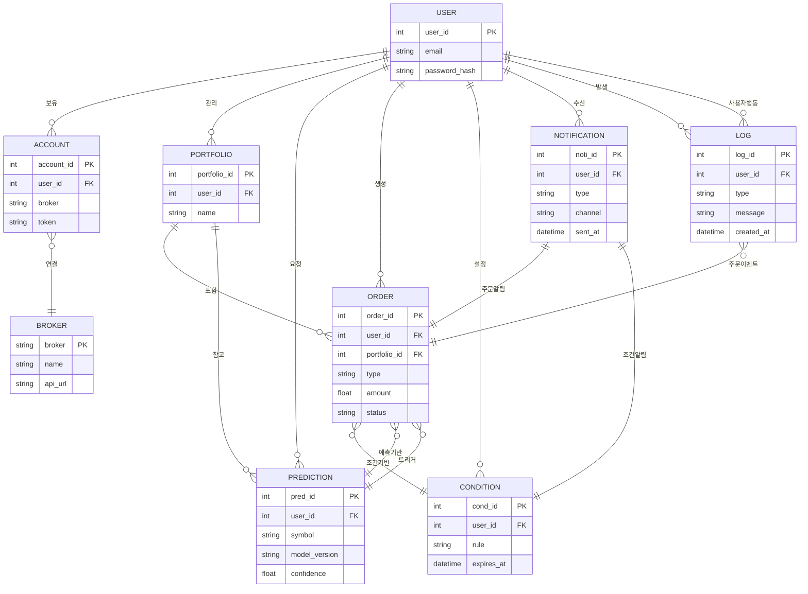
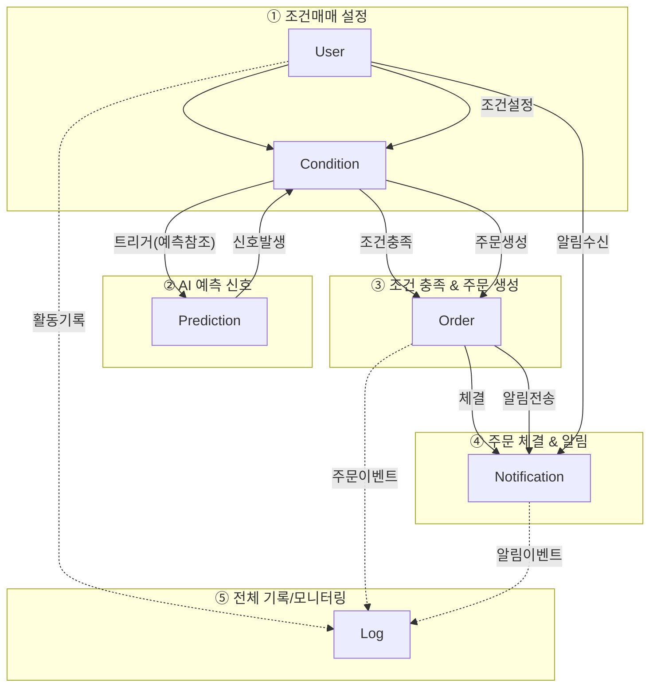
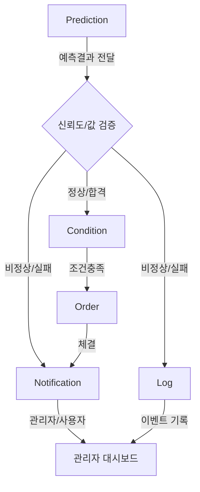
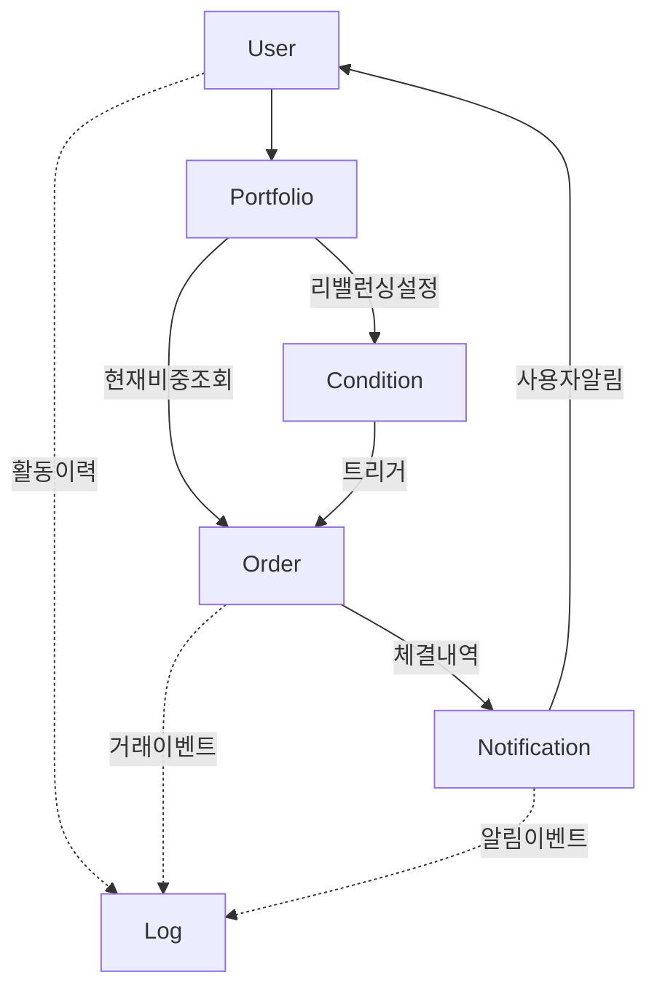
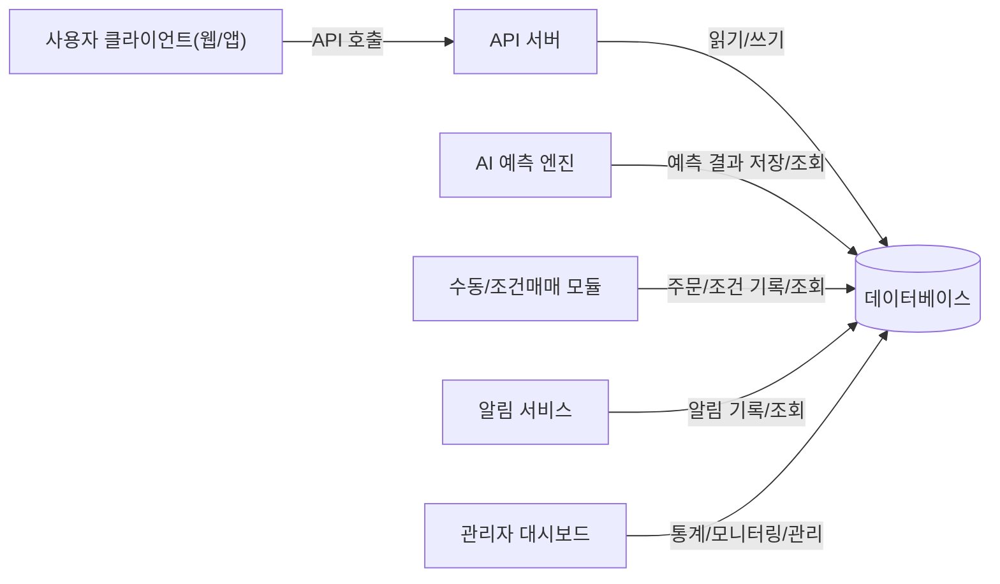

# 데이터베이스 구조 (Database Design)

---

## 설계 개요

이 데이터베이스는 BotFolio 서비스가 AI 예측, 조건매매, 실시간 주문, 알림 등 각 기능을 안정적으로 지원할 수 있도록 관계형 구조와 최소한의 중복 설계를 지향했습니다.  
각 테이블은 실제 서비스의 흐름과 확장성, 보안, 데이터 무결성을 모두 고려하여  설계되었습니다.

## 역할 및 위치

BotFolio 서비스의 모든 **핵심 데이터**(사용자, 계좌, 포트폴리오, 주문, 예측 결과, 알림, 로그 등)를 **안전하게 저장·관리하는 중심 저장소**입니다.
모든 서버·엔진·대시보드가 이 DB와 연결되어 실시간 트랜잭션·이력·통계·감사 등 모든 데이터 흐름의 허브 역할을 수행합니다.

---

## ERD (엔터티 관계도)

아래 ERD는 BotFolio의 전체 데이터 흐름과 주요 테이블 간의 관계(연결)를 한눈에 보여줍니다.



---

## 테이블 구조 및 설명

BotFolio 데이터베이스의 각 테이블은 서비스의 주요 기능 흐름에 맞춰 설계되었습니다.
사용자(User)는 여러 계좌(Account)와 포트폴리오(Portfolio)를 보유할 수 있고,
각 포트폴리오에는 다양한 종목의 투자내역과 주문(Order)이 기록됩니다.
AI 예측 결과(Prediction)는 사용자별, 포트폴리오별로 저장되며
주문(Order)이나 조건매매(Condition)의 트리거로 활용될 수 있습니다.

조건매매(Condition)는 사용자가 직접 설정한 투자 조건을 저장하고,
이 조건이 충족될 경우 자동으로 주문(Order)을 생성합니다.
모든 주문, 예측, 조건매매 과정은 알림(Notification)을 통해 사용자에게 실시간으로 전달됩니다.

시스템의 안정적 운영을 위해, 모든 주요 활동과 이벤트는 Log 테이블에 기록되어
관리자 대시보드 등에서 모니터링 및 감사 목적으로 활용됩니다.

이 구조를 통해

- **서비스의 데이터 일관성**,
- **실시간 처리**,
- **확장/유지보수**

모두를 만족할 수 있습니다.

| 테이블 | 주요 컬럼(예시)                    | 설명                       |
|--------|-----------------------------------|----------------------------|
| User   | user_id, email, password_hash, ...| 회원 정보/권한/알림설정    |
| Account| account_id, user_id, broker, ...  | 계좌/증권사/연동정보       |
| Portfolio | portfolio_id, user_id, ...     | 종목/비중/목표             |
| Prediction | pred_id, user_id, symbol, ... | 예측결과/모델/신뢰도       |
| Order  | order_id, user_id, type, status...| 주문/체결/이력             |
| Condition | cond_id, user_id, ...          | 조건매매 설정/만료/트리거  |
| Notification | noti_id, user_id, ...       | 알림 이력/채널/타입        |
| Log    | log_id, time, type, message, ...  | 시스템 이벤트/에러/감사     |

---

## 시나리오 예시

서비스에서 실제로 일어날 수 있는 대표적인 데이터 활용 시나리오와,  
이와 관련된 테이블 간 관계, 그리고 이를 해결하는 쿼리 예시를 아래와 같이 정리합니다.

---

### 조건매매 + AI 예측 + 알림 연동 전체 흐름 예시

사용자 A는 “AI 신뢰도 90% 이상, 삼성전자 매수 신호가 발생하면
내 계좌로 자동 매수를 하고, 주문 체결 시 알림을 받기”로 조건매매를 등록했다.
며칠 뒤 AI 엔진이 해당 신호를 감지하고, 자동으로 조건매매가 실행되어 주문이 들어가고,
주문이 체결되자 사용자에게 실시간 알림이 전송된다.
운영자는 대시보드에서 이 전체 내역을 추적/분석하고 싶다.



시나리오 단계별 주요 쿼리

(A) 조건매매와 연동된 AI 예측 신호 찾기

```sql
-- 최근 7일 이내, 신뢰도 90% 이상, 삼성전자 '매수' 신호
SELECT * FROM Prediction
WHERE symbol = '삼성전자'
  AND confidence >= 0.9
  AND model_version = 'LatestAI'
  AND pred_id IN (
      SELECT pred_id FROM Condition
      WHERE user_id = 123
        AND rule LIKE '%매수%'
        AND expires_at > NOW()
  )
ORDER BY pred_id DESC;
```

(B) 조건 충족 시 자동 주문 내역(Condition→Order)

```sql
-- 위에서 감지된 예측 신호와 연결된 자동 주문 내역
SELECT * FROM Order
WHERE user_id = 123
  AND type = 'conditional'
  AND portfolio_id IN (
      SELECT portfolio_id FROM Condition
      WHERE user_id = 123
        AND rule LIKE '%매수%'
  )
ORDER BY order_id DESC;
```

(C) 주문 체결 알림 이력

```sql
-- 해당 주문이 체결된 뒤, 알림 발송 내역(푸시+이메일 등)
SELECT * FROM Notification
WHERE user_id = 123
  AND type = 'order_executed'
  AND sent_at > (SELECT MIN(created_at) FROM Order WHERE user_id = 123)
ORDER BY sent_at DESC;
```

(D) 운영자 관점 - 전체 이벤트/로그 조회

```sql
-- 관련된 모든 활동(조건 생성, 주문 실행, 알림 발송 등)의 로그
SELECT * FROM Log
WHERE user_id = 123
  AND created_at > NOW() - INTERVAL 7 DAY
ORDER BY created_at DESC;
```

---

### AI 예측 엔진 오작동·업데이트 대응 시나리오 예시

AI 예측 엔진이 일시적으로 잘못된 결과(이상치, 결측, 논리 오류 등)를 출력해서
조건매매 시스템에 비정상 신호가 전달될 수 있다.
이때 서비스는

- 예측 신뢰도/결과값 검증(Validation)
- 의심 신호 로그 기록 및 차단
- 실제 주문 체결 차단
- 관리자/사용자에게 경고 알림

등으로 “오작동 주문”을 사전에 방지한다.



시나리오 단계별 주요 쿼리

(A) 신뢰도 임계치 이하/결측치 등 '의심 예측' 기록 조회

```sql
SELECT * FROM Prediction
WHERE (confidence < 0.5 OR confidence IS NULL)
   OR symbol IS NULL
   OR model_version IS NULL
ORDER BY pred_id DESC;
```

(B) 최근 24시간 내 예측 오류/경고 알림 발송 내역

```sql
SELECT * FROM Notification
WHERE type = 'ai_warning'
    AND sent_at > NOW() - INTERVAL 1 DAY
ORDER BY sent_at DESC;
```

(C) 비정상 예측/주문이 실제 체결되지 않았는지 검증

```sql
SELECT * FROM Order
WHERE created_at > NOW() - INTERVAL 1 DAY
    AND status = 'pending'
    AND pred_id IN (
        SELECT pred_id FROM Prediction
        WHERE confidence < 0.5 OR confidence IS NULL
  );
```

---

### 포트폴리오 리밸런싱(재조정) 시나리오

사용자 B는 자신의 포트폴리오 내 종목 비중을 주기적으로 “리밸런싱(재조정)”한다.
예를 들어, 특정 종목이 너무 올라서 비중이 커지면 자동으로 일부를 매도하고, 다른 종목을 비중에 맞게 자동 매수한다.
이 때 시스템은

- 각 포트폴리오의 현재 비중,
- 최근 거래내역(주문/체결),
- 리밸런싱 설정 조건(목표 비중, 트리거 주기 등)을

실시간으로 확인하고
필요할 경우 자동으로 주문을 실행한다.
모든 리밸런싱 기록은 로그로 남으며,
체결 결과와 함께 사용자에게 알림이 전송된다.



시나리오 단계별 주요 쿼리

(A) 리밸런싱 대상 포트폴리오의 현재 종목 비중 조회

```sql
SELECT portfolio_id, symbol, SUM(amount) AS total_amount
FROM Order
WHERE user_id = 456
    AND portfolio_id = 789
GROUP BY portfolio_id, symbol;
```

(B) 목표 비중과 비교하여 주문 필요 여부 확인

```sql
-- 예: 목표 비중 대비 과다 보유 종목 추출
SELECT symbol, SUM(amount) AS cur_amount
FROM Order
WHERE user_id = 456
    AND portfolio_id = 789
GROUP BY symbol
HAVING cur_amount > [목표비중];
```

(C) 리밸런싱 주문 실행 및 결과 알림

```sql
-- 리밸런싱 주문 체결 후 알림 내역
SELECT * FROM Notification
WHERE user_id = 456
    AND type = 'rebalance_executed'
ORDER BY sent_at DESC;
```

---

## 아키텍처 연결 구조

- **API 서버**
  - 모든 사용자 데이터/주문/포트폴리오 처리에 직접 연결
- **AI 예측 엔진**
  - 예측 결과 저장, 히스토리 관리
- **조건매매/수동매매 모듈**
  - 조건 설정/감시/주문 결과 기록
- **알림 서비스**
  - 발송/수신 이력 및 상태 기록
- **관리자 대시보드**
  - 전체 통계, 리포트, 감사·운영 모니터링



---

## 관리/보안/운영 포인트

- 모든 데이터 암호화 저장 및 접근 권한 관리
- 주요 변경 이력/감사 로그 자동 기록
- 대용량 트랜잭션 처리와 장애 복구(백업/복제 등) 설계 적용
- 개인정보 보호 및 보안 정책(삭제/익명화 등) 적용

---

> **Note:**
> 본 문서의 ERD/테이블 구조, 쿼리, 시나리오 등은 실제 서비스 요구사항 및 개발 상황에 따라 조정될 수 있습니다.  
> 필드 타입/제약조건/인덱스 등 상세 스키마는 코드(ORM, SQL) 또는 별도 설계서와 반드시 싱크하세요.  
> 개인정보 보호, 데이터 암호화, 백업/복구 등 보안 정책은 실제 배포 환경에서 별도 검토·적용이 필요합니다.  
> 본 문서 내 쿼리/시나리오는 이해를 돕기 위한 예시로, 실서비스 요구/운영에 맞게 수정하세요.  
> 팀 내 피드백/추가 의견/현업 경험은 자유롭게 이 Note에 기록 가능합니다.
