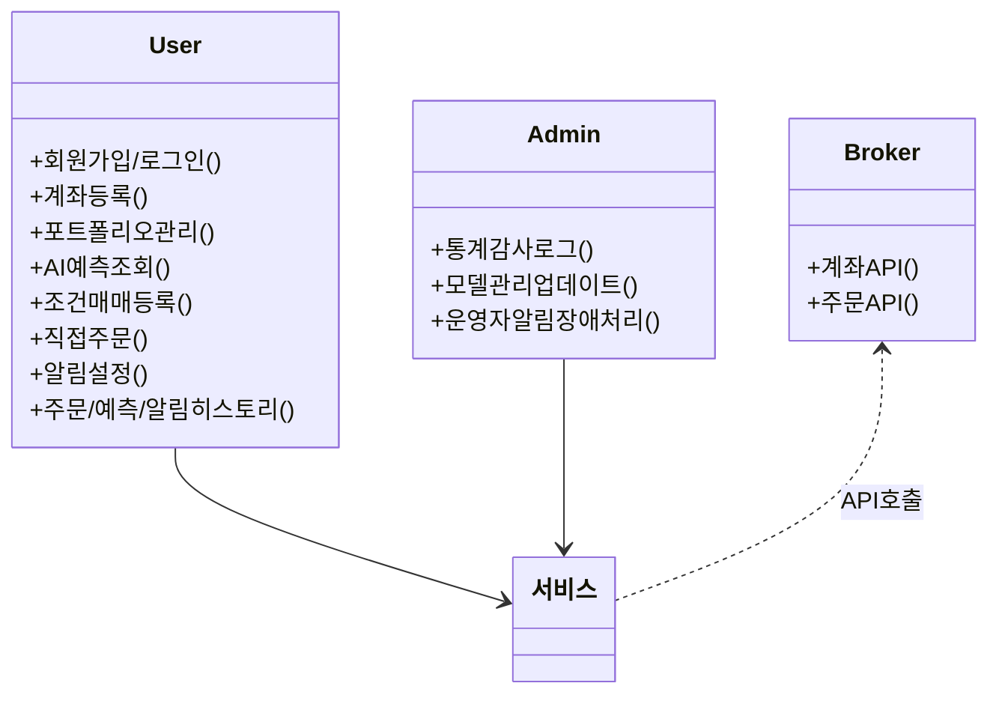

# 주요 요구사항 및 유즈케이스 (Requirements & Use Cases)

---

## 개요

본 페이지에서는 BotFolio 서비스(주식 자동매매/AI 주가 예측/커뮤니티 등)가  
반드시 만족해야 할 **핵심 요구사항**과  
주요 사용 시나리오(Use Case)를 총괄적으로 다룹니다.

---

## 대표 유즈케이스

- **회원가입/로그인/계좌 연동**
- **포트폴리오 생성/관리**
- **AI 예측 모델 선택/조회**
- **조건매매 등록/실행/수정/취소**
- **직접 주문/취소**
- **주문/예측/알림 히스토리 조회**
- **알림 수신 설정/이력 관리**
- **관리자 통계/감사/로그 관리**

---

## Use Case Diagram

아래 다이어그램은 BotFolio의 대표 유즈케이스와  
주요 액터(사용자, 관리자, 외부 시스템 등) 관계를 시각화합니다.

---

## 요구사항 총괄표

|구분|설명|항목 수|
|:---:|:---|:---:|
|시스템 기능 요구사항(SFR, System Function Requirement)|해당 시스템이 반드시 수행하여야하거나 사용자가 반드시 수행할 수 있어여하는 기능(혹은 동작)에 대해 기술.|19|
|성능 요구사항(PER, Peformance Requirement)|생략|7|
|보안 요구사항(SER, Security Requirement)|생략|9|
|품질 요구사항(QUR, Quality Requirement)|생략|9|

---

## 요구사항 목록

|ID|요구사항 이름|
|:-------:|:---|
|SFR-01-01|메인 페이지에서 포트폴리오·주문·예측·알림 요약 제공|
|SFR-01-02|실시간 주가 정보 조회|
|SFR-01-03|직접 주문/취소 기능 지원|
|SFR-02-01|AI 예측 모델 선택 및 버전별 관리(업데이트, 롤백, 비교 등)|
|SFR-02-02|AI 주가 예측 결과 및 신뢰도, 백테스트 리포트 제공|
|SFR-02-03|예측 결과 기반 자동/조건매매 연동|
|SFR-02-04|예측 신뢰도/결과값 검증을 통한 오작동 주문 차단|
|SFR-02-05|AI 예측 모델 업데이트 시 사용자 알림 및 버전별 이력 관리|
|SFR-03-01|조건매매/수동매매 등록, 감시, 자동 실행 및 내역 관리|
|SFR-03-02|다양한 투자 전략(고점 돌파, 거래량 추종 등) 등록/백테스트 지원|
|SFR-03-03|포트폴리오 리밸런싱(자동 재조정) 및 관련 기록 관리|
|SFR-04-01|다양한 거래소/증권사 API 통합 연동 및 계좌 관리|
|SFR-04-02|거래소 API 오류/장애 자동 감지 및 핫스왑, 운영자 알림 처리|
|SFR-04-03|시스템 장애 발생 시 자동 복구 및 Failover 지원|
|SFR-05-01|알림 서비스 통한 주문·조건 충족·시스템 이벤트 실시간 알림|
|SFR-05-02|알림 채널(푸시/이메일/SMS 등) 다중 지원 및 구독/해제 관리|
|SFR-06-01|관리자 대시보드: 실시간 서비스 현황/통계/로그 모니터링|
|SFR-07-01|데이터베이스 내 모든 트랜잭션/주문/알림/이력 통합 관리|
|SFR-07-02|서비스 주요 이벤트 및 사용자 행위의 감사 로그 저장·조회|
|PER-01|실시간 주가 정보 조회 처리|
|PER-02|AI 예측 결과 실시간 처리|
|PER-03|대량 동시 주문/알림 처리 지원|
|PER-04|데이터베이스 대용량 트랜잭션 처리|
|PER-05|외부 거래소 API 장애 대응 성능|
|PER-06|알림 서비스 멀티채널 발송 성능|
|PER-07|관리자 대시보드 실시간 통계 제공|
|SER-01|사용자 개인정보 암호화 및 접근제어|
|SER-02|사용자 자산정보 비공개 및 비식별화|
|SER-03|계좌/주문 데이터 암호화 및 안전한 저장|
|SER-04|서비스 전 구간 데이터 전송 암호화(SSL/TLS)|
|SER-05|2단계 인증(2FA) 및 권한별 접근 통제|
|SER-06|알림/로그 등 주요 데이터 감사 및 변경 이력 기록|
|SER-07|외부 API 인증 및 토큰 보안|
|SER-08|개인정보 삭제/익명화 및 관련 정책 적용|
|SER-09|관리자/운영자 접근 및 권한관리|
|QUR-01|서비스 신뢰성 및 장애 내성|
|QUR-02|데이터 무결성 및 일관성 유지|
|QUR-03|사용자 인터페이스(UI/UX) 사용성|
|QUR-04|확장성(모듈·플러그인·DB 구조 등)|
|QUR-05|시스템 운영 및 유지보수 용이성|
|QUR-06|실시간 모니터링 및 관리자 지원|
|QUR-07|이력/감사/로그 기록 및 조회의 용이성|
|QUR-08|백업·복구·데이터 보존성|
|QUR-09|다양한 디바이스/브라우저 호환성|

---

## 상세 요구사항

### [SFR] 시스템 기능 요구사항

|ID|요구사항 이름|
|:-------:|:---|
|SFR-01|메인/주문/조회 (사용자 클라이언트, 기본 기능)|
|SFR-02|AI 예측 관련 (모델/예측/신뢰도/알림)|
|SFR-03|조건/전략/포트폴리오 관리 (자동매매/투자전략)|
|SFR-04|거래소 연동/확장/안정성 (API 계층)|
|SFR-05|알림 서비스 (알림/채널/이력)|
|SFR-06|관리자 대시보드 (운영/모니터링)|
|SFR-07|데이터베이스/감사 (통합관리/로그/이력)|

#### SFR-01-01. 메인 페이지에서 포트폴리오·주문·예측·알림 요약 제공

(대시보드 역할) 서비스 홈(메인) 페이지는

- 사용자가 BotFolio에 접속했을 때,
- 현재 투자 현황, 주요 정보, 즉각적 액션이 필요한 알림 등을
확인할 수 있도록
- 포트폴리오 요약, 최근 주문/예측 결과, 알림을 시각화해서

제공해야 함.

##### SFR-01-01 충족 판단 기준 (Acceptance Criteria)

필수 요구사항

- 포트폴리오 요약
  - 사용자의 현재 포트폴리오 별 자산 현황, 수익률, 종목 수 등 요약 정보가 한눈에 보인다.
  - 각 포트폴리오별 상세 화면으로 이동 가능하다.
- 최근 주문 내역:
  - 최근 체결/취소/진행중 주문이 최신순으로 5~10건 이상 보인다.
  - 주문 상세(종목, 수량, 가격, 상태 등) 확인 및 상세 페이지로 이동 가능하다.
- AI 예측 결과 요약:
  - 최신 AI 예측 결과(예측 종목, 방향, 신뢰도, 예측치 등)가 메인에 요약된다.
  - 예측 상세 및 과거 예측 히스토리로 바로 이동할 수 있다.
- 최근 알림 내역:
  - 주문 체결, 조건매매 실행, 시스템 이벤트 등 최근 주요 알림이 최신순으로 보인다.
  - 읽지 않은 알림에 강조 표시가 있고, 알림 상세/이력 관리로 이동 가능하다.
- 즉시 실행 가능한 버튼/진입점 제공:
  - [조건매매 등록], [직접 주문], [예측 상세], [알림 확인] 등 주요 기능 바로가기 버튼이 배치되어 있다.
- 실시간 데이터 반영:
  - 페이지를 새로고침하거나 단일 클릭만으로도 실시간 데이터가 새로 갱신된다.
  - (WebSocket 등 활용시 알림/주문 변화가 바로 반영됨)

추가 옵션(향후 개선)

- 사용자별 맞춤형 위젯 구성(배치 변경/숨김)
- 각 포트폴리오별 주요 이벤트(목표 달성, 변동성 등) 실시간 경고
- 투자 전략 추천/AI 신호 하이라이트 등

디테일/구현 예시

- UI/UX
  - 데스크톱/모바일 모두 대시보드 레이아웃 최적화
  - 종목/포트폴리오별 카드 또는 표 방식
  - "오늘의 알림/실행 필요 액션"을 상단에 강조 배치
- API/아키텍처 연동
  - 클라이언트(웹/앱)는 API 서버를 통해 포트폴리오 데이터, 주문 이력, 예측 결과, 알림 내역을 별도 API로 한 번에 받아옴.
  - 실시간 변화(주문/알림 등)는 WebSocket/Polling 기반으로 즉시 반영

예시 시나리오

- 사용자가 로그인 시

  1. 메인 화면에서 내 포트폴리오 수익률, 최근 주문·알림·AI 예측 한눈에 확인
  2. [조건매매 등록] 클릭하여 곧바로 전략 입력
  3. 체결된 주문은 즉시 알림, 메인화면에 반영됨
- 최근 알림("삼성전자 조건매매 체결", "AI 예측 신호 감지") 클릭
  1. 상세 이력·조건/예측 정보로 바로 이동

실제 판단 예시(통합 테스트 시)

- "포트폴리오/주문/예측/알림" 모두 메인에서 요약 조회/이동 가능
- 새 주문·알림 발생 시, 3초 내 UI에 반영
- 사용성 평가에서 '한눈에 현황 파악 가능' 응답률이 80% 이상

#### SFR-01-02. 실시간 주가 정보 조회

사용자는 종목명/코드(Ticker)를 검색 또는 선택해서,
해당 종목의 실시간 주요 시장 정보(주가, 호가, 변동, 거래량 등)를
조회할 수 있어야 한다.
또한, 단일 종목뿐 아니라 관심종목 리스트 등 다수 종목을 한 번에 조회·비교할 수 있어여 한다.

##### SFR-01-02 충족 판단 기준 (Acceptance Criteria)

사용자는 종목명을 1. 검색, 2. 자동완성, 혹은 3. 리스트에서 선택해 시장 정보(주가/호가/거래량/전일 대비/고저가 등)를 확인 가능하다.

- 조회 응답(클릭 후 정보 노출) 시간이 3초 이내
- API 서버가 각 거래소/증권사 API와 실시간 연동(실시간성 데이터)
- 관심종목 등록/삭제, 순위 보기 등 부가 기능 지원
- 복수 종목 동시 조회(관심종목 탭/카드/리스트 방식 등) 제공
- 가격 알림/조건매매 바로가기 연동(예: "이 가격에서 매수 등록")
- 잘못된 종목/없는 코드 검색시 적절한 예외/알림 제공

디테일/구현 예시

- 프론트엔드:
  - 새로고침 없이, 실시간/자동 갱신
  - 입력창 자동완성, 종목 상세 정보 카드
- 백엔드/아키텍처:
  - API 서버가 거래소 API 추상화 계층을 통해
  - 실시간 가격/호가/거래량 요청
  - 응답 캐싱, 에러/지연시 재시도
- DB/기록:
  - 사용자의 조회 이력(최근 본 종목) DB에 저장, 추천/알림에 활용

#### SFR-01-03. 직접 주문/취소 기능

직접 매매: 사용자가 수동으로 주문 정보를 입력하여 주문(매수/매도/취소)을 직접 요청하는 것.

- 주문 정보: 가격, 수량, 주문 유형(지정가/시장가 등), 계좌(복수 지원) 등
주문 정보 직접 입력
- 주문 요청 즉시 거래소에 주문 요청
- 주문 체결 결과를 바로 확인 및 알림 수신
- 실시간 주문 내역 및 히스토리 조회가 가능해야 함

##### SFR-01-03 충족 판단 기준 (Acceptance Criteria)

- 직접 매수/매도/취소 주문을 웹/앱에서 직접 입력·제출 가능
- 주문 즉시(1초 이내) 거래소 API를 통해 실시간으로 주문 요청/응답
- 체결 성공/실패 결과, 취소 등 모든 주문 상태 실시간 알림(푸시/이메일 등) 전송
- 주문 상세(종목, 수량, 가격, 유형 등) 정보 및 주문 이력 조회 가능
- 주문 오류(잔고부족, 미인증 등) 발생 시 적절한 안내/실패 알림 제공
- DB에 모든 주문·체결 내역 기록

디테일/구현 예시

- UI/UX:
  - 주문 입력 폼(종목, 가격, 수량, 유형 등)
  - 체결 상태/잔고/수수료 실시간 안내
- API 서버:
  - 주문 요청 → 거래소 API 추상화 계층 → 실제 거래소 주문
  - 응답 지연/실패시 에러처리 및 사용자 알림
  - 주문 결과 DB 기록, 주문 이력 관리
- 알림/내역 관리:
  - 모든 주문 결과를 실시간 알림 서비스로 전달
  - 사용자별 주문/체결/취소 내역 페이지 제공

---

### [PER] 성능 요구사항

---

### [SER] 보안 요구사항

---

### [QUR] 품질 요구사항

---
