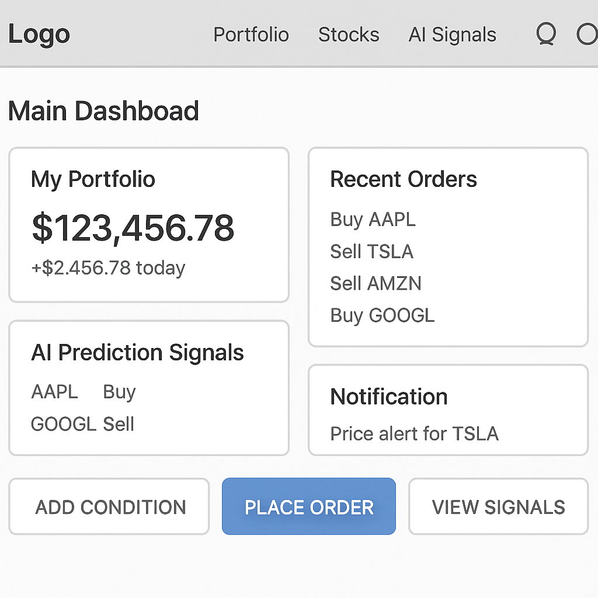

# 화면 설계 및 와이어프레임 (Wireframe)

---

## 개요

본 문서는 BotFolio의 **주요 UI 화면 구조**를  
와이어프레임(간단 도식+설명)으로 제시합니다.  
페이지별 주요 구성요소, 액션 버튼, 데이터 영역 등  
기획/개발/디자인/테스트 팀 모두가 빠르게 “전체 감”을 잡는 데 활용하세요.

---

## 목차

- [메인 대시보드](#메인-대시보드)
- [실시간 주가 조회](#실시간-주가-조회)
- [주문/취소 입력](#주문취소-입력)
- [조건매매/전략 관리](#조건매매전략-관리)
- [AI 예측 결과](#ai-예측-결과)
- [알림함](#알림함)
- [관리자 대시보드](#관리자-대시보드)

---

## 메인 대시보드

- **포인트**  
  - 핵심 요약 정보(포트폴리오·주문·알림·예측)를 “첫 화면”에  
  - 알림/주문 등 주요 액션 바로가기 버튼 상시 배치

---

## 실시간 주가 조회

(그림)

- **포인트**  
  - 검색/관심종목 추가·삭제 UI  
  - 가격 알림/조건매매 등록 진입 연동

---

## 주문/취소 입력

(그림)

- **포인트**  
  - 즉시 주문·취소 입력 및 상태 확인  
  - 최근 주문 내역·체결 실시간 반영

---

## 조건매매/전략 관리

(그림)

- **포인트**  
  - 조건 등록/수정/삭제  
  - 복합전략·AI 연동 조건 표현

---

## AI 예측 결과

(그림)

- **포인트**  
  - 예측·신뢰도·변동성 한눈에  
  - 모델 변경/업데이트 내역, 백테스트 시각화

---

## 알림함

(그림)

- **포인트**  
  - 미확인/중요 알림 강조  
  - 알림 구독/채널설정 진입 연동

---

## 관리자 대시보드

(그림)

- **포인트**  
  - 장애 감지/알림, 시스템 상태 요약  
  - 모델/전략별 관리·이력 조회

---

> **Note:**  
> 실제 개발/디자인 단계에서는  
> Figma/AdobeXD 등 상세 UI 툴로 보완하거나  
> 각 기능별 상세 화면은 [FeatureDesign.md](./FeatureDesign.md)와  
> 연동해서 문서화하세요!
